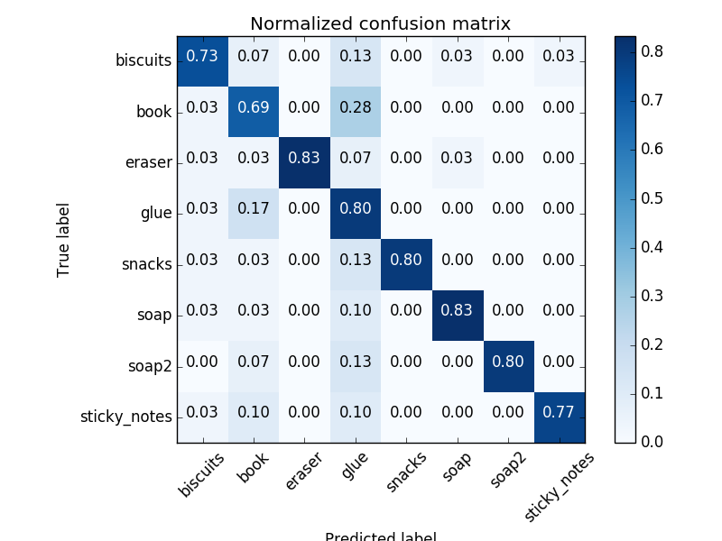
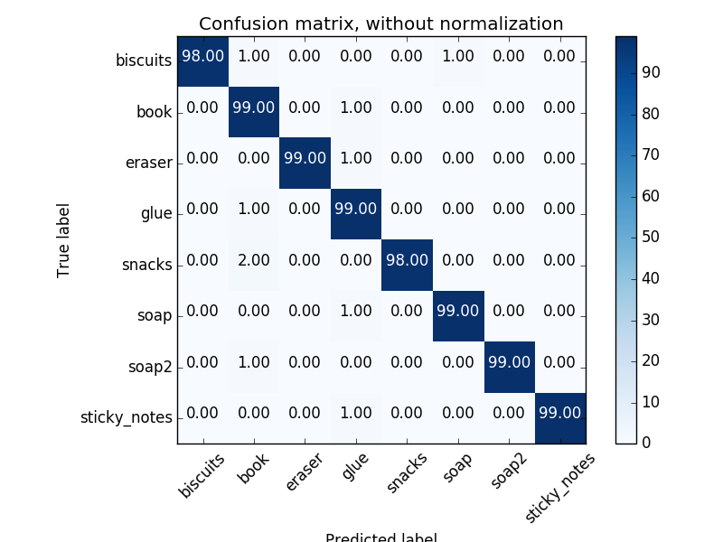

# RoboND-Perception-Project

## Project: Perception Pick & Place
### Introduction
One of the primary challenges in warehousing goods is strking the optimal balance between storage density and labor. In an effort to reduce labor, automated storage and retrieval systems (ASRS) have historically been used with positive results especially in manufacturing where the shape and size of the inventory to be stored is highly consistent and repeatable. The handling of full pallet goods can similarly benifit owing to the standard dimensions of the pallets on which they are stored. However in retail (i.e. Target) or direct to guest fulfillment (i.e. amazon.com) where the dimensions of items to be stored are highly variable and their unit of measure for storage can include loose items, the efficiency of traditional ASRS systems degrades due to several factors. Firstly, these systems are most efficient when they can move items in bulk since their cycle times are usually fixed regardless of the quantity of product moved. Secondly, many of these systems are not capable of storing items loosely without some form of container, bin or tray. These containers invariablly waste space since they are typically constrained to a few fixed sizes. One solution to this problem is to store multiple items in a single bin or shelving unit which can be handled reliably by the automation while recouping some of the lost efficiencies of utilizing bins. The one drawback of this approach being that the ASRS is capable of handling items at the bin level, not at the item level, and it is unlikely that an order will perfectly match all items stored within a bin. This has given rise to so-called 'goods-to-man' ASRS systems (e.g. Kiva, Autostore) that are designed to deliver the bins of mixed items to a human operator who then completes the task of removing the needed items from the bin before signaling the ASRS to return the bin to the storage area. These systems are semi-automated, since an operator has now been introduced to perform the final task of identifying, selecting and removing the desired product from the delivered bin. The logical evolution of a 'goods-to-man' solution would be a 'goods-to-robot' solution. Such a solution could potentially realize the labor savings of an ASRS system while maintaining the storage efficiency benifits of mixed bins.

One of the primary challenges to implementing a goods-to-robot system is that historically robots have struggled to match the speed and accuracy of human operators at the final picking task when leveraging mixed sku bins. However recent solutions from companies like Righthand Robotics and others are starting to realize near human speed at this task. 

In this exercise, the goal will be to use computer vision to perform the first two steps of the process required to autonomously pick and place mixed items. First the solution will take simulated input from an RGBD camera to recognize and identify the items presented in each of 3 scenarios. Following identification the solution will compute the locations of each objects centroid and then publish that information to the project for use in path planning and retrieval by the PR2 robot in the simulation. 

---
### Project Steps / Requirements
The successful project will complete the following steps and requiremnts:

1. Extract features and train an SVM model on new objects.
2. Write a ROS node and subscribe to the data being fed from the simulated RGBD camera
3. Since the simulated feed from teh RGBD camera includes noise, a filter should be implemented to remove it.
4. Utilize necessary filtering and RANSAC plane fitting to isolate the objects of interest from the rest of the scene.
4. Apply Euclidean clustering to create separate clusters for individual items.
5. Perform object recognition on these objects and assign them labels.
6. Calculate the centroid of the set of points belonging to that each object.
7. Create ROS messages containing the details of each object.
8. Correctly identify objects in 3 scenarios with the following success rates:
  * Scenario 1: Identify 100% of the objects correctly (3 of 3 objects presented)
  * Scenario 2: Identify 80% of the objects correctly (4 of 5 objects presented)
  * Scneario 3: Identify 75% of the objects correctly (6 of 8 objects presented)

#### Project Artifacts
  * Perception Script: [perception_server.py](perception_server.py)
  * features Script (normal & color Histograms) [features.py](features.py)
  * Scenario 1 yaml: [output_1.yaml](output_1.yaml)
  * Scenario 2 yaml: [output_2.yaml](output_2.yaml)
  * Scenario 3 yaml: [output_3.yaml](output_.yaml)
  

---
### Extracting and Training Features
Classifying the individual objects was done using a Support Vector Machine that is trained on two feature vectors: 
  * A HSV color space histogram
  * A surface normal histogram

The following models were used to train the SVM. It is assumed that all objects presented in the scenarios will be members of this list:
  * biscuits
  * soap
  * soap2
  * book
  * glue
  * sticky_notes
  * snacks
  * eraser
----
#### Color Only Approach (A Mistake)
This section retains the summary of the results from my first attempt following a mistake in the surface normal histogram calculation. The historgram function was incorrectly configured for a range of (0,256) when the correct range should have been at (-1,1) for unit normal vectors. When set at 32 bins the oversight resulted in normal histograms that were identical for all items since all normal vectors ended up in the same bin with the rest of the bins being zero.
Despite that oversight, which effectively turned the SVM into a color only classifier, the output still exceeded minimum project requirements for accuracy only failing to identify one item (glue bottle) in the third world. The settings used for this attempt were:   
  * Kernel = rbf
  * C = 4.0
  * gamma = 'auto'
  * n Samples = 30

#### Color Only confusion matrices:




----
#### Revised Approach (Corrected)
Contrary to expectations, the addition of the surface normal data increased the instances of mis-identified objects especially the case where items are mis-identified as 'book'. Multple attempts at changing bin sizes, SVM kernels and sample sizes did not appear to consistently improve results to the level of the original color only filter. A filter applied to the histogram to reduce noise had some limited success, but ultimately did not get the model back to the accuracy of the color only sample. Due to fluctuation in SVM accuracy induced by the random sample generation, the sample generator was changed from a random pose generator, to a deterministic step-wise sample generator. The original intent being that, if nothing else, it would remove the variability introduced by  the randomness of the sampling so that effects of changing model parameters could be attributed directly to the changes made. However the first run of the SVM model creation with the stepwise generator produced such positive results, it was retained. The stepwise sampling was implemented by modifying [catpture_features.py](captures_features.py) to pass roll, pitch, yaw to [training_helper.py](training_helper.py) which was modified to accept them as arguments. The following criteria were used to generate the SVM training set.

  * roll = 0 (constant)
  * pitch = 0 - pi (in steps of pi/10)
  * yaw = 0 - 2pi (in steps of pi/10)

This resulted in a total of 100 training samples generated (per item). The SVM was then rerun wiht the same parameters as preveiously used:

  * Kernel = rbf
  * C = 4.0
  * gamma = 'auto

#### Confusion matrices:



### Recieving, Filtering, and Conditoining the Point Cloud Data
#### Recieving the Point Cloud
To begin processing the camera data, the raw simulated feed was first subscribed to as follows:
```python
pcl_sub = rospy.Subscriber("/pr2/world/points", pc2.PointCloud2, pcl_callback, queue_size=1)
```
#### Removing Noise
As previously mentioned, this point cloud data contains noise to mimick a real camera. To remove the noise a statistical filter was applied that compares each point to the average values of its neighbors and and then filters out points that are found to be statistical outliers in comparison. Two parameters are definable for the statistcal filter, the number of neighbors sampled and the number of standard deviations from the mean to be considered an outlier. Good results were found for this project with the following parameters:
  * Number of neighbors sampled = 6
  * Outlier std deviation from mean = .001
  
Results of applying the statistical filter with the above settings both before and after:


#### Conditioning Point Cloud to Improve Computational Performance
To improve performance, two steps were taken to reduce the complexity of the noise filtered pointcloud. First a voxel grid downsampling was performed to reduce the overall number of cloud points. This process averages the properties of pixels within user defined volumes to create a lower resolution, but more computationally manageable point clound. Leaf size chosen for this exersize was .005 as it provided adequate performance, while maintaining decent visual representations of the objects. 
The second step applied was to filter out all points that were not in the region of interest (i.e. outside of the table). This was done utilizing two passthrough filters: A filter in the z axis to remove all points below the table and a fiter applied to the y axis to remove all poits to the left and right of the table. One can see in the image below-right that the points below the table and to either side have been clipped following passthrough filtering.


### RANSAC segmentation and Euclidian Clustering
Once the noise is removed from the point cloud and it is at a resolution that is manageable for the virtual environment to process, the tasks of separating out and identifying the objects present can begin. To accomplish this the first step was to identify all the points that belong to the table and remove those. What is left over should represent the objects, if any, that are sitting on the table. This was done using the Random Sample Consensus (RANSAC) method. Since the table represents a collection of planes, the RANSAC model utilized was SACMODEL_PLANE with a distance threshold of .01. Originally a value of .004 was tried, but it failed to capture the plane that represented the front edge of the table, so it was increased to .01.
Once the table was removed, the next step was to apply the Euclidian Clustering to segment the point clould in to smaller point clouds for each object. Also known as DBSCAN, as covered in lecture 18.7, the algorithm takes three parameters as input: the minumum/maximum number of points a cluster can contain and the maximum distance between cluster points. For the purposes of this project, the following settings provided adequate results:
  * Minimum Cluster Points = 75
  * Maximum Cluster Points = 2000
  * Maximum Point Distance = 0.02
  
Below the individual clusters are shown on the right, after being identified from the point cloud following removal of the table by RANSAC segmentation.


### Object Recognition and Labeling
After the objects have been separated into individual clusters, the surface normal and HSV histograms for each cluster can be passed to the SVM classifier, which will utilize the model dataset trained previously to identify each of the clusters as an item from the training set. In the example shown below (from scenario 3), all of the items are correctly identified using this method except for the 'book' in the upper left. This is actually the 'glue' object. However, it is partially ocluded by the book, and thus ends up being misclassified as another book.


### Centroid Determination and ROS Messaging
Following identification, the next step in the pipeline is to determine the centroid of each object and publish it as a ROS message so that it can be consumed by the motion plannning algorithm and passed to the PR2 for pick and place. The centroid was calculated using the average of all the points in an objects cluster as follows:

```python
centroid = np.mean(points_arr, axis=0)[:3]
```
Once the centroid was determined, it was then published as a ROS message that also contained: 
  * the scenario number (test_scene_num)
  * the object name(object_name)
  * the arm name (arm_name) to perform the pick/place based on the destination bin requested
  * the pick pose(pick_pose) the centroid of the object
  * the place poase(place_pose) the centrold of the destination bin

The message contents were also written to yaml files for each scneario as well to aid in project submission.

---

## Color Histogram Only Results

### Scenario 1
#### Overall: 100%

| Expected Item     |Expected Bin    |Expected Arm     |Detected Item | Assigned Bin |Assigned Arm  |
|-------------------|----------------|-----------------|--------------|--------------|--------------|
| biscuits          | green          | right           | biscuits     | green        | right        |
| soap              | green          | right           | soap         | green        | right        |
| soap2             | red            | left            | soap2        | red          | left         |

### Scenario 2
#### Overall: 100%

| Expected Item     |Expected Bin    |Expected Arm     |Detected Item | Assigned Bin |Assigned Arm  |
|-------------------|----------------|-----------------|--------------|--------------|--------------|
| biscuits          | green          | right           | biscuits     | green        | right        |
| soap              | green          | right           | soap         | green        | right        |
| book              | red            | Left            | book         | red          | left         |
| soap2             | red            | Left            | soap2        | red          | left         |
| glue              | red            | Left            | glue         | red          | left         |

### Scenario 3
#### Overall: 87.5%

| Expected Item     |Expected Bin    |Expected Arm     |Detected Item | Assigned Bin |Assigned Arm  |
|-------------------|----------------|-----------------|--------------|--------------|--------------|
| sticky_notes      | red            | left            | sticky_notes | red          | left         |
| book              | red            | left            | book         | red          | left         |
| snacks            | green          | right           | snacks       | green        | right        |
| biscuits          | green          | right           | biscuits     | green        | right        |
| eraser            | red            | left            | eraser       | red          | left         |
| soap2             | green          | right           | soap2        | green        | right        |
| soap              | green          | right           | soap         | green        | right        |
| glue              | red            | Left            | NOT DETECTED | N/A          | N/A          |

## Summary / Conclusion
The methods described above were almost entirely successful at identifying the items presented in all three worlds. The one exception being the glue present in scenario 3 which was at times either not identified at all, or incorrectly identified as a book. Since the glue was successfully identified in scenario 2 consistently, I believe the primary driver of this was due to the view of the glue being ocluded by the book. A potential solve for this would be to pan the robot slightly right or left to obtain a clearer view of the objects when partially blocked from vew. 

With respect to the environment, significant challenges were encountered in actually getting the robot to complete pick and place operations in Gazebo. The robot would repeatedly fail to pick up objects, or drop objects, following what appeared to be an otherwise perfectly valid grasp maneuver. Waiting an extended time following the grasping step, and changing the friction coefficients in the world file did not appear to have any positive effect on this behavior. It is likely that had the robot been able to consistently grab objects, the book would have been successfully moved and the glue positively identified for a perfect score on all 3 scenarios.
